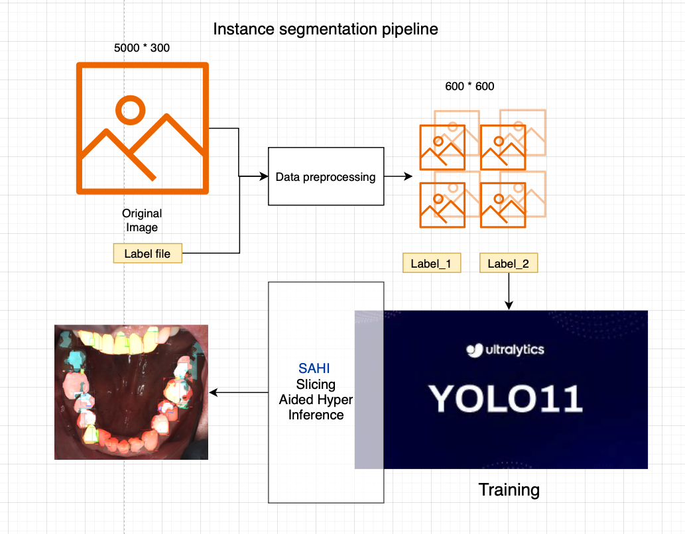

# Alpha-dent-slicing-aided-training + Inference
Instance segmentation of the alpha-dent dataset with slicing-aided training and hyper-inference.

Refer to the link below for a detailed report - [Link](https://buckeyemailosu-my.sharepoint.com/personal/prasadsudha_1_buckeyemail_osu_edu/_layouts/15/onedrive.aspx?id=%2Fpersonal%2Fprasadsudha%5F1%5Fbuckeyemail%5Fosu%5Fedu%2FDocuments%2FCSE%205524%20%2D%20Final%20Project%20%2D%20AlphaDent&ga=1)

## Architecture

This section describes the overall structure and design of the Alpha Dent Slicing Aided Training system.

### System Overview

The architecture diagram below illustrates the key components and their interactions:



## Requirements


----

## File Descriptions

- **./**: Source code for the instance segmentation model and training scripts.
- **/data**: Contains the alpha-dent dataset used for training and testing the model.
- **/weights**: Pre-trained model checkpoints and enhanced training optimal checkpoints.
- **/validation**: A few images to test predictions.
- **/results**: Folder where the best results, checkpoints, graphs, etc., are stored. The output folder can be modified for each folder.

## AlphaDent (Data)

- Download the data from https://www.kaggle.com/competitions/alpha-dent/data
- Enter the AlphaDent folder, copy all folders within it, and paste them under the data folder. (Folders to be copied - images, labels, yolo_seg_train.yml)

## Weights Setup

- Download weights from the link - [Link](https://buckeyemailosu-my.sharepoint.com/:f:/g/personal/brundayogananda_1_buckeyemail_osu_edu/IgDn6FtCx5A0Srp7MHUHErwLAdP9LaCYIlVj4BkLmIAXiVs?e=Okye8o&xsdata=MDV8MDJ8fDUwMmRkODQ5OWNiZjQ0MmY4MDY2MDhkZTNkZDQ3NzkwfGViMDk1NjM2MTA1MjQ4OTU5NTJiMWZmOWRmMWQxMTIxfDB8MHw2MzkwMTYxNzk4ODE1MDg5NjZ8VW5rbm93bnxWR1ZoYlhOVFpXTjFjbWwwZVZObGNuWnBZMlY4ZXlKRFFTSTZJbFJsWVcxelgwRlVVRk5sY25acFkyVmZVMUJQVEU5R0lpd2lWaUk2SWpBdU1DNHdNREF3SWl3aVVDSTZJbGRwYmpNeUlpd2lRVTRpT2lKUGRHaGxjaUlzSWxkVUlqb3hNWDA9fDF8TDJOb1lYUnpMekU1T2paaE9XVTVNRGs1TFRRek56a3ROR1JsTnkxaE5tRXhMVEk0WWprMVptVmhNRGt3WlY5aE16Y3hZakF3TmkxaVltSXdMVFJsTlRFdE9UWmpOQzFsT1dGaE16aGxZekJoTVdGQWRXNXhMbWRpYkM1emNHRmpaWE12YldWemMyRm5aWE12TVRjMk5qQXlNVEU0TmpneE13PT18NjQzODllMWFiNjRlNDQ5MGUxNzEwOGRlM2RkNDc3OGZ8MjEzZmQzNzI0MzE1NGY5M2JiMmU4M2NlZTdmMzgzMWI%3D&sdata=TTdoZDFZUkdrQWtlTG8zZ0hINWJMUWZtMVpFeE9RZmxCSW15Nms5U0dKRT0%3D&ovuser=eb095636-1052-4895-952b-1ff9df1d1121%2Cbrundayogananda.1%40buckeyemail.osu.edu)

- Extract the downloaded files and place them in the `/weights` folder
- The folder structure should be:
    - `yolo11x-seg.pt` - pre-trained yolov11 checkpoint
    - `yolov8x-seg.pt` - pre-trained yolov8 checkpoint
    - `yolov8/yolov8_best.pt` - Best model checkpoint after fine tuning YOLOv8
    - `yolov11/yolov11_best.pt` - Best model checkpoint after fine tuning YOLOv11
    - Any other pre-trained checkpoints can be added here.

## Environment Setup

1. Clone the repository:
    ```bash
    git clone https://github.com/brijeshnandaby/alpha-dent-slicing-aided-training.git
    cd alpha-dent-slicing-aided-training
    ```

2. Create a conda environment:
    ```bash
    conda create -n alpha-dent python=3.11
    ```

3. Activate the environment:
    ```bash
    conda activate alpha-dent
    ```

4. If GPU-enabled inference is performed, download the relevant version of PyTorch (torch, torchvision) using the command below:
    ```bash
    pip install torch torchvision torchaudio --index-url https://download.pytorch.org/whl/cu121
    ```

5. Install required packages:
    ```bash
    pip install -r requirements.txt
    ```

## Train + Inference

- To train the model with patched images (overlapping images), use the image_cropper.py file to generate the dataset.
- Create data:
```bash
python3 image_cropper.py --base-path data --output-path data_640 --tile-width 640 --tile-height 640 
```
- Train/fine-tune the model:
```bash
python3 train.py <base_data_folder> <output_folder> <epochs> <image_size>
```
- The submission.csv file and submission_high_conf.csv are available in the base folder, containing all segmentation results.

## SAHI Inference

- Run:
```bash
python3 sahi_inference.py <data_folder> <output_folder> <tile_height> <tile_width> <overlap_ratio>
```
- Check the visuals folder to get an idea of sample results and visualizations.
- sahi_submission.csv and sahi_high_conf_submission.csv are result files with all segmentations.


## Repository Structure

```
alpha-dent-slicing-aided-training/
├── README.md                 # Project documentation
├── requirements.txt          # Python dependencies
├── image_cropper.py          # Script to generate tiled dataset
├── train.py                  # Model training script
├── sahi_inference.py         # SAHI-based inference script
├── data/                     # Dataset directory
│   ├── images/               # Raw training images
│   ├── labels/               # Segmentation masks
│   └── yolo_seg_train.yml    # YOLO configuration
├── data_640/                 # Generated tiled dataset (640x640)
├── weights/                  # Model checkpoints
├── validation/               # Sample images for testing
├── results/                  # Output folder for checkpoints, graphs, and results
└── doc/                      # Documentation and diagrams
    └── architecture.png      # System architecture diagram
```

## References

- **Kaggle (2025).** AlphaDent: Teeth marking. Retrieved from https://www.kaggle.com/competitions/alpha-dent/overview
- **Sosnin, E. I., et al. (2025).** AlphaDent: A dataset for automated tooth pathology detection. *arXiv preprint arXiv:2507.22512*. https://arxiv.org/abs/2507.22512
- **Ultralytics (2024).** YOLOv8 vs YOLO11: Evolution of Real-Time Object Detection. https://docs.ultralytics.com/compare/yolov8-vs-yolo11/#architecture-and-key-features_1
- **Ultralytics (2023).** Segment. https://docs.ultralytics.com/tasks/segment/#predict
- **Akyon, F. C., Altinuc, S. O., & Temizel, A. (2022).** Slicing Aided Hyper Inference and Fine-tuning for Small Object Detection. *arXiv preprint arXiv:2202.06934*. https://arxiv.org/abs/2202.06934
- **Facebook Research.** SAM3 README_TRAIN.md. https://github.com/facebookresearch/sam3/blob/main/README_TRAIN.md
- **NVlabs.** SegFormer: Official PyTorch implementation. https://github.com/NVlabs/SegFormer
- **Roboflow.** Train an RF-DETR Model. https://rfdetr.roboflow.com/learn/train/

### Contact

- [Brijesh Nanda](mailto:brundayogananda.1@osu.edu)
- [Mrunal Hole](mailto:hole.17@buckeyemail.osu.edu)
- [Dhaarini P S](mailto:prasadsudha.1@buckeyemail.osu.edu)

